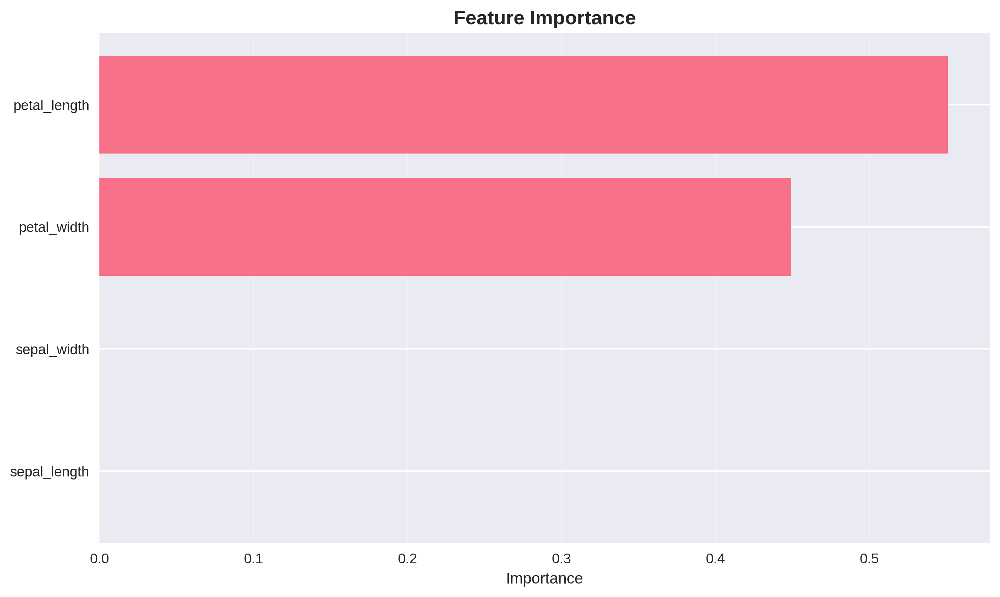
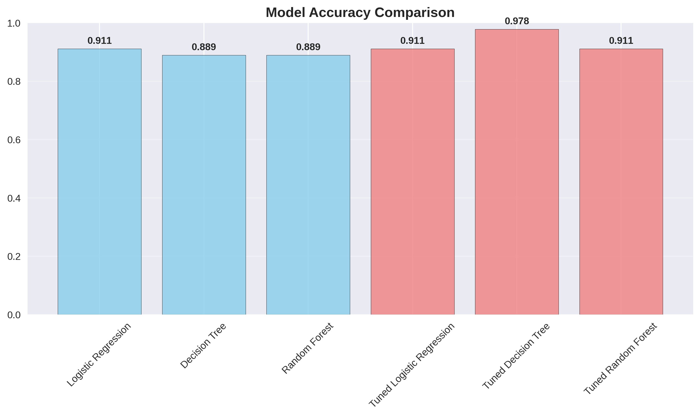
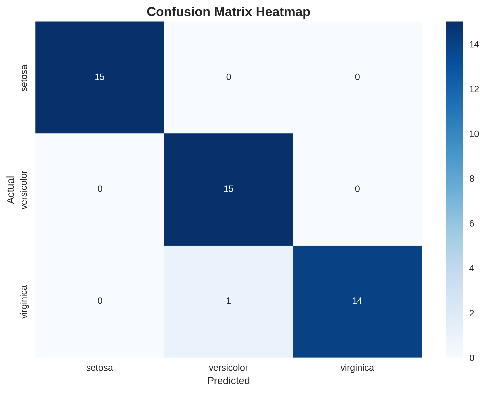

# 🌸 Iris Flower Classification Model

A supervised machine learning project that builds and evaluates classification models to predict the species of iris flowers based on petal and sepal measurements. This project demonstrates core concepts in predictive modeling, model evaluation, and hyperparameter tuning using Python.

---

## 1. Introduction

**Problem Statement:**  
The Iris dataset contains measurements of three flower species; Setosa, Versicolor, and Virginica. The challenge is to build a model that can accurately classify a flower into its correct species based on four numerical features: sepal length, sepal width, petal length, and petal width.

**Objectives:**  
- Build and evaluate classification models using supervised learning  
- Apply preprocessing techniques to prepare the data  
- Compare model performance using standard metrics  
- Visualize decision boundaries and prediction accuracy

**Business Context:**  
Accurate classification of biological specimens is essential in agriculture, research, and automation. This project simulates a real-world classification task, demonstrating how machine learning can support decision-making in domains requiring categorical prediction.

---

## 2. Data Preparation

- Loaded the classic Iris dataset from scikit-learn  
- Checked for missing values and data integrity  
- Scaled features using StandardScaler  
- Split data into training and testing sets (70:30 ratio)

---

## 3. Exploratory Analysis

**Interpretation Framework:**  
- Pairplots and scatterplots reveal feature relationships and species clusters  
- Correlation matrix highlights strong relationships between petal length and petal width  
- Feature distributions show clear separation between species

**Key Insights:**  
- Petal measurements are more predictive than sepal measurements  
- Setosa is easily separable; Versicolor and Virginica show partial overlap  
- Feature scaling improves model performance consistency

---

## 4. Model Building & Evaluation

- Trained multiple classifiers: Logistic Regression, Decision Tree, Random Forest  
- Evaluated models using accuracy, precision, recall, and F1-score  
- Used GridSearchCV for hyperparameter tuning  
- Visualized confusion matrix and classification report

---

## 5. Results

- All models achieved high accuracy (>90%)  
- Decision Tree delivered the best balance across precision and recall  
- The confusion matrix confirmed a strong predictive performance  
- Decision boundaries showed clear separation for Setosa; overlap between Versicolor and Virginica

---

## 6. Practical Applications

**Business Insights:**  
Machine learning can automate classification tasks in agriculture, biology, and logistics, reducing manual effort and improving accuracy.

**Actionable Recommendations:**  
- Use petal-based features for efficient classification  
- Deploy Decision Tree for robust performance across species  
- Integrate model into real-time systems for automated labeling

**Risk Management:**  
- Monitor model performance on new data to avoid drift  
- Retrain periodically to maintain accuracy  
- Validate predictions with domain experts in high-stakes applications

---

## 7. Conclusion

**Key Findings Summary:**  
- Petal length and width are the most predictive features  
- Decision Tree outperformed other models in balanced accuracy  
- Visualizations confirmed strong model interpretability

**Limitations:**  
- The dataset is small and balanced; real-world data may be noisier  
- Limited to three species; not generalizable to broader taxonomy

**Future Work:**  
- Extend to multi-class classification with larger datasets  
- Deploy model via API or dashboard interface  
- Explore deep learning approaches for complex classification tasks

---

